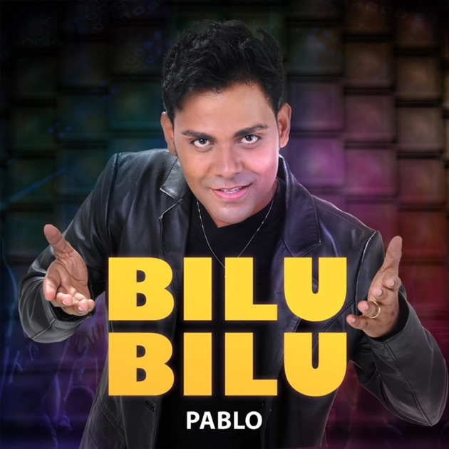
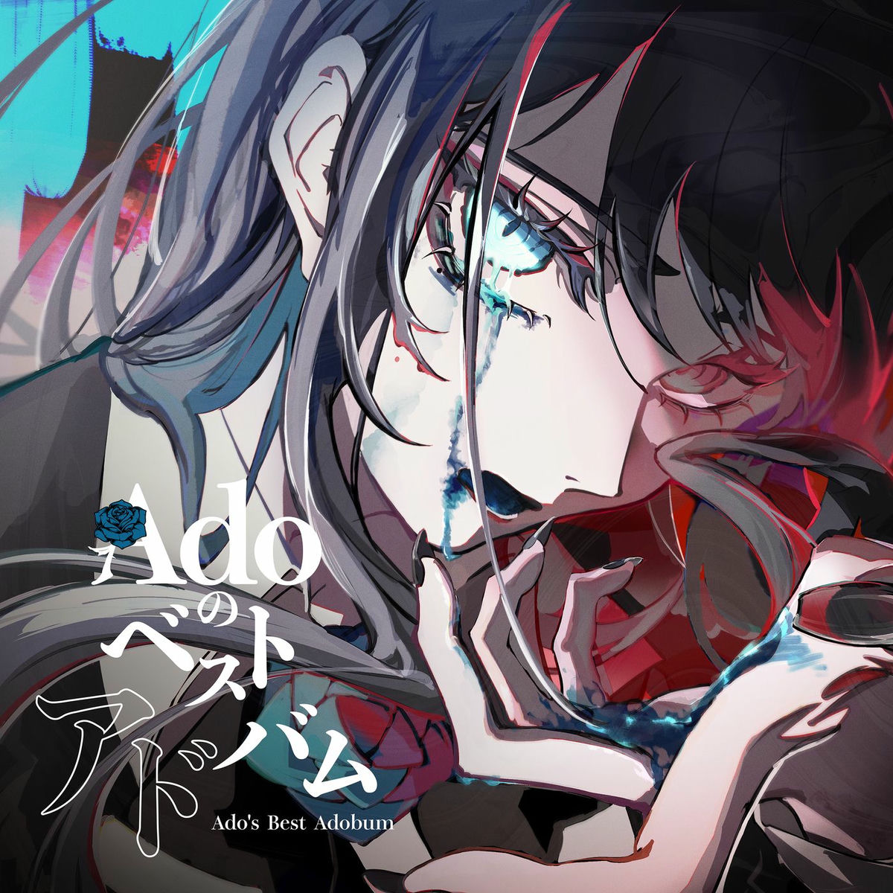

<div align="center">
  
  <h1>🎵 SYNKRØ - Rhythm Game 🎮</h1>
  <p>
    <b>O ritmo está em suas mãos!</b><br>
    
    
    
  </p>
</div>

---

## 📖 Sobre o Projeto

SYNKRØ é um jogo de ritmo moderno, feito com [React](https://react.dev/) + [Vite](https://vitejs.dev/), que desafia seus reflexos e sua sincronia musical! Escolha sua música favorita, ajuste as opções gráficas e de áudio, e mergulhe em uma experiência visual neon inspirada nos melhores arcades.

> **Destaques:**
> - 🎼 Seleção de músicas com capas e estatísticas
> - ⚡ Interface estilizada com efeitos neon e gradientes
> - 🕹️ Engine Godot integrada para gameplay fluido
> - 🛠️ Painel de opções para personalizar gráficos, áudio e temas

---

## 🖼️ Screenshots

<div align="center">
  
  
  
</div>

---

## 🚀 Como Rodar

```sh
# Instale as dependências
npm install

# Inicie o servidor de desenvolvimento
npm run dev
